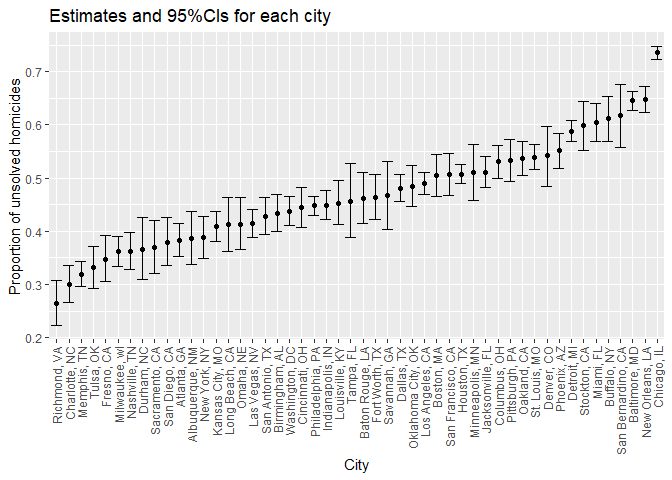
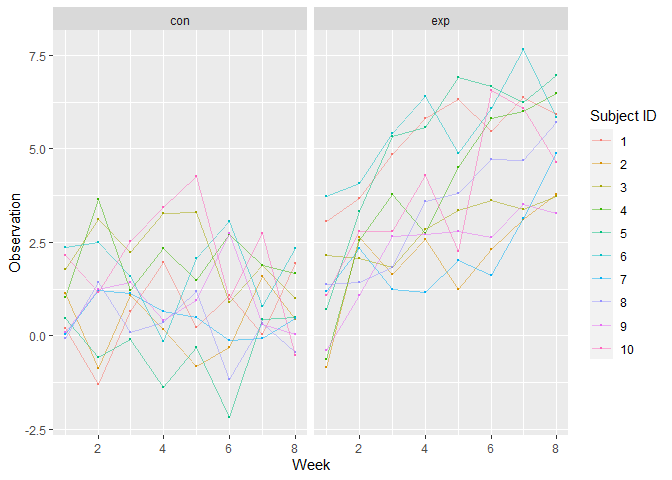
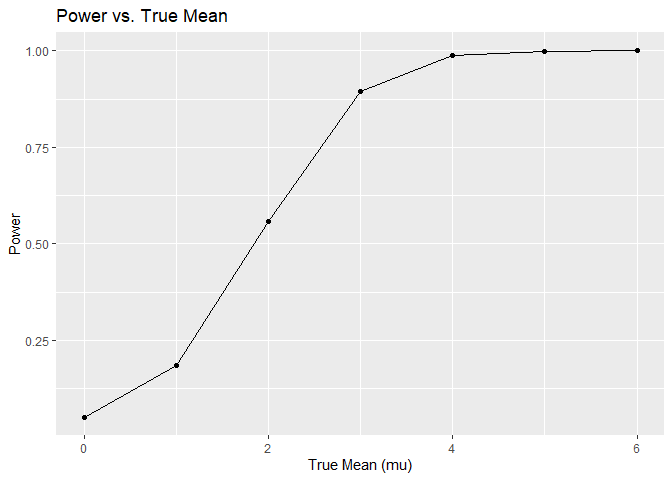
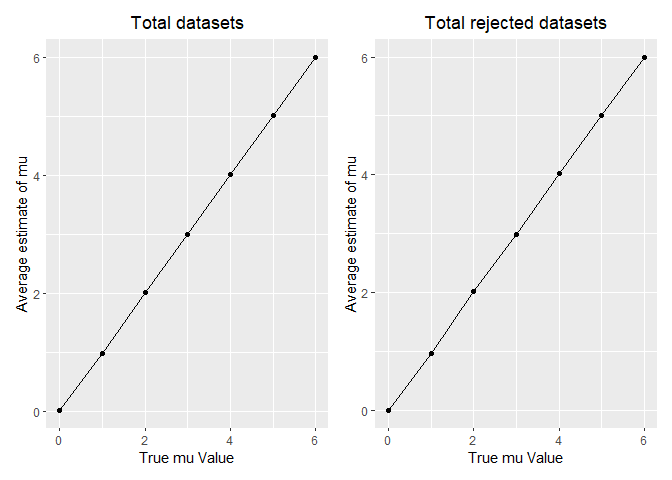

HW5
================
Danny Nguyen
2023-11-10

# Question 1

### Import Data

``` r
homicide <- read_csv("homicide-data.csv")
```

    ## Rows: 52179 Columns: 12
    ## ── Column specification ────────────────────────────────────────────────────────
    ## Delimiter: ","
    ## chr (9): uid, victim_last, victim_first, victim_race, victim_age, victim_sex...
    ## dbl (3): reported_date, lat, lon
    ## 
    ## ℹ Use `spec()` to retrieve the full column specification for this data.
    ## ℹ Specify the column types or set `show_col_types = FALSE` to quiet this message.

This dataframe has 52179 rows and 12 columns of criminal homicides
across 50 major U.S. cities over a decade, detailing locations, arrest
rates, and victim demographics, such as `reported_date`, `victim_race`,
`victim_gender`, `disposition` etc.

``` r
homicide <- homicide %>% 
  mutate(city_state = paste(city, state, sep =", ")) 

unresolved = homicide %>% 
  group_by(city_state) %>% 
  summarize( 
    total_homicide = n(),
    unsolved = sum(disposition %in% c("Closed without arrest", "Open/No arrest"))) %>%
  filter(city_state != "Tulsa, AL")

unresolved
```

    ## # A tibble: 50 × 3
    ##    city_state      total_homicide unsolved
    ##    <chr>                    <int>    <int>
    ##  1 Albuquerque, NM            378      146
    ##  2 Atlanta, GA                973      373
    ##  3 Baltimore, MD             2827     1825
    ##  4 Baton Rouge, LA            424      196
    ##  5 Birmingham, AL             800      347
    ##  6 Boston, MA                 614      310
    ##  7 Buffalo, NY                521      319
    ##  8 Charlotte, NC              687      206
    ##  9 Chicago, IL               5535     4073
    ## 10 Cincinnati, OH             694      309
    ## # … with 40 more rows

### Baltimore Unresolved Homicides

``` r
baltimore <- unresolved %>% 
  filter(city_state == "Baltimore, MD")

baltimore_test <- prop.test(
  x= baltimore %>% pull(unsolved),
  n = baltimore %>%pull(total_homicide))%>% 
  broom::tidy()

baltimore_test
```

    ## # A tibble: 1 × 8
    ##   estimate statistic  p.value parameter conf.low conf.high method        alter…¹
    ##      <dbl>     <dbl>    <dbl>     <int>    <dbl>     <dbl> <chr>         <chr>  
    ## 1    0.646      239. 6.46e-54         1    0.628     0.663 1-sample pro… two.si…
    ## # … with abbreviated variable name ¹​alternative

The estimated proportion of homicides in Baltimore, MD is 64.6% and its
95%CI interval is (62.8%, 66.3%).

### Plot: The Estimates and CIs for Each City

``` r
prop_cities = unresolved %>% 
  mutate(
    test = map2(.x = unsolved, .y = total_homicide, ~prop.test(x = .x, n = .y)),
    test = map(test,broom::tidy))%>%
  unnest() %>%
  select(city_state, estimate, conf.low, conf.high)%>%
  arrange(desc(estimate))
```

    ## Warning: `cols` is now required when using `unnest()`.
    ## ℹ Please use `cols = c(test)`.

``` r
prop_cities %>%
  ggplot(aes(x=reorder(city_state, estimate), y= estimate)) + 
  geom_point() + 
  geom_errorbar(aes(ymin = conf.low, ymax = conf.high)) +
   labs(title = "Estimates and 95%CIs for each city",x = "City", y = "Proportion of unsolved homicides") +   
  theme(axis.text.x = element_text(angle = 90, vjust = 0.5, hjust=1))
```

<!-- -->

# Question 2

### Import data list

``` r
df <- 
  tibble(list.files("./hw5_data/data")) %>%
  mutate(file_list = paste(list.files("./hw5_data/data/")))

read_files <- function(x) {
  
    data = read_csv(paste0("./hw5_data/data/", x)) %>%
      mutate(file_names = x)
}

longitudinal_data <- map_df(df$file_list, read_files)
```

    ## Rows: 1 Columns: 8
    ## ── Column specification ────────────────────────────────────────────────────────
    ## Delimiter: ","
    ## dbl (8): week_1, week_2, week_3, week_4, week_5, week_6, week_7, week_8
    ## 
    ## ℹ Use `spec()` to retrieve the full column specification for this data.
    ## ℹ Specify the column types or set `show_col_types = FALSE` to quiet this message.
    ## Rows: 1 Columns: 8
    ## ── Column specification ────────────────────────────────────────────────────────
    ## Delimiter: ","
    ## dbl (8): week_1, week_2, week_3, week_4, week_5, week_6, week_7, week_8
    ## 
    ## ℹ Use `spec()` to retrieve the full column specification for this data.
    ## ℹ Specify the column types or set `show_col_types = FALSE` to quiet this message.
    ## Rows: 1 Columns: 8
    ## ── Column specification ────────────────────────────────────────────────────────
    ## Delimiter: ","
    ## dbl (8): week_1, week_2, week_3, week_4, week_5, week_6, week_7, week_8
    ## 
    ## ℹ Use `spec()` to retrieve the full column specification for this data.
    ## ℹ Specify the column types or set `show_col_types = FALSE` to quiet this message.
    ## Rows: 1 Columns: 8
    ## ── Column specification ────────────────────────────────────────────────────────
    ## Delimiter: ","
    ## dbl (8): week_1, week_2, week_3, week_4, week_5, week_6, week_7, week_8
    ## 
    ## ℹ Use `spec()` to retrieve the full column specification for this data.
    ## ℹ Specify the column types or set `show_col_types = FALSE` to quiet this message.
    ## Rows: 1 Columns: 8
    ## ── Column specification ────────────────────────────────────────────────────────
    ## Delimiter: ","
    ## dbl (8): week_1, week_2, week_3, week_4, week_5, week_6, week_7, week_8
    ## 
    ## ℹ Use `spec()` to retrieve the full column specification for this data.
    ## ℹ Specify the column types or set `show_col_types = FALSE` to quiet this message.
    ## Rows: 1 Columns: 8
    ## ── Column specification ────────────────────────────────────────────────────────
    ## Delimiter: ","
    ## dbl (8): week_1, week_2, week_3, week_4, week_5, week_6, week_7, week_8
    ## 
    ## ℹ Use `spec()` to retrieve the full column specification for this data.
    ## ℹ Specify the column types or set `show_col_types = FALSE` to quiet this message.
    ## Rows: 1 Columns: 8
    ## ── Column specification ────────────────────────────────────────────────────────
    ## Delimiter: ","
    ## dbl (8): week_1, week_2, week_3, week_4, week_5, week_6, week_7, week_8
    ## 
    ## ℹ Use `spec()` to retrieve the full column specification for this data.
    ## ℹ Specify the column types or set `show_col_types = FALSE` to quiet this message.
    ## Rows: 1 Columns: 8
    ## ── Column specification ────────────────────────────────────────────────────────
    ## Delimiter: ","
    ## dbl (8): week_1, week_2, week_3, week_4, week_5, week_6, week_7, week_8
    ## 
    ## ℹ Use `spec()` to retrieve the full column specification for this data.
    ## ℹ Specify the column types or set `show_col_types = FALSE` to quiet this message.
    ## Rows: 1 Columns: 8
    ## ── Column specification ────────────────────────────────────────────────────────
    ## Delimiter: ","
    ## dbl (8): week_1, week_2, week_3, week_4, week_5, week_6, week_7, week_8
    ## 
    ## ℹ Use `spec()` to retrieve the full column specification for this data.
    ## ℹ Specify the column types or set `show_col_types = FALSE` to quiet this message.
    ## Rows: 1 Columns: 8
    ## ── Column specification ────────────────────────────────────────────────────────
    ## Delimiter: ","
    ## dbl (8): week_1, week_2, week_3, week_4, week_5, week_6, week_7, week_8
    ## 
    ## ℹ Use `spec()` to retrieve the full column specification for this data.
    ## ℹ Specify the column types or set `show_col_types = FALSE` to quiet this message.
    ## Rows: 1 Columns: 8
    ## ── Column specification ────────────────────────────────────────────────────────
    ## Delimiter: ","
    ## dbl (8): week_1, week_2, week_3, week_4, week_5, week_6, week_7, week_8
    ## 
    ## ℹ Use `spec()` to retrieve the full column specification for this data.
    ## ℹ Specify the column types or set `show_col_types = FALSE` to quiet this message.
    ## Rows: 1 Columns: 8
    ## ── Column specification ────────────────────────────────────────────────────────
    ## Delimiter: ","
    ## dbl (8): week_1, week_2, week_3, week_4, week_5, week_6, week_7, week_8
    ## 
    ## ℹ Use `spec()` to retrieve the full column specification for this data.
    ## ℹ Specify the column types or set `show_col_types = FALSE` to quiet this message.
    ## Rows: 1 Columns: 8
    ## ── Column specification ────────────────────────────────────────────────────────
    ## Delimiter: ","
    ## dbl (8): week_1, week_2, week_3, week_4, week_5, week_6, week_7, week_8
    ## 
    ## ℹ Use `spec()` to retrieve the full column specification for this data.
    ## ℹ Specify the column types or set `show_col_types = FALSE` to quiet this message.
    ## Rows: 1 Columns: 8
    ## ── Column specification ────────────────────────────────────────────────────────
    ## Delimiter: ","
    ## dbl (8): week_1, week_2, week_3, week_4, week_5, week_6, week_7, week_8
    ## 
    ## ℹ Use `spec()` to retrieve the full column specification for this data.
    ## ℹ Specify the column types or set `show_col_types = FALSE` to quiet this message.
    ## Rows: 1 Columns: 8
    ## ── Column specification ────────────────────────────────────────────────────────
    ## Delimiter: ","
    ## dbl (8): week_1, week_2, week_3, week_4, week_5, week_6, week_7, week_8
    ## 
    ## ℹ Use `spec()` to retrieve the full column specification for this data.
    ## ℹ Specify the column types or set `show_col_types = FALSE` to quiet this message.
    ## Rows: 1 Columns: 8
    ## ── Column specification ────────────────────────────────────────────────────────
    ## Delimiter: ","
    ## dbl (8): week_1, week_2, week_3, week_4, week_5, week_6, week_7, week_8
    ## 
    ## ℹ Use `spec()` to retrieve the full column specification for this data.
    ## ℹ Specify the column types or set `show_col_types = FALSE` to quiet this message.
    ## Rows: 1 Columns: 8
    ## ── Column specification ────────────────────────────────────────────────────────
    ## Delimiter: ","
    ## dbl (8): week_1, week_2, week_3, week_4, week_5, week_6, week_7, week_8
    ## 
    ## ℹ Use `spec()` to retrieve the full column specification for this data.
    ## ℹ Specify the column types or set `show_col_types = FALSE` to quiet this message.
    ## Rows: 1 Columns: 8
    ## ── Column specification ────────────────────────────────────────────────────────
    ## Delimiter: ","
    ## dbl (8): week_1, week_2, week_3, week_4, week_5, week_6, week_7, week_8
    ## 
    ## ℹ Use `spec()` to retrieve the full column specification for this data.
    ## ℹ Specify the column types or set `show_col_types = FALSE` to quiet this message.
    ## Rows: 1 Columns: 8
    ## ── Column specification ────────────────────────────────────────────────────────
    ## Delimiter: ","
    ## dbl (8): week_1, week_2, week_3, week_4, week_5, week_6, week_7, week_8
    ## 
    ## ℹ Use `spec()` to retrieve the full column specification for this data.
    ## ℹ Specify the column types or set `show_col_types = FALSE` to quiet this message.
    ## Rows: 1 Columns: 8
    ## ── Column specification ────────────────────────────────────────────────────────
    ## Delimiter: ","
    ## dbl (8): week_1, week_2, week_3, week_4, week_5, week_6, week_7, week_8
    ## 
    ## ℹ Use `spec()` to retrieve the full column specification for this data.
    ## ℹ Specify the column types or set `show_col_types = FALSE` to quiet this message.

``` r
longitudinal_data
```

    ## # A tibble: 20 × 9
    ##    week_1 week_2 week_3 week_4 week_5 week_6 week_7 week_8 file_names
    ##     <dbl>  <dbl>  <dbl>  <dbl>  <dbl>  <dbl>  <dbl>  <dbl> <chr>     
    ##  1   0.2   -1.31   0.66   1.96   0.23   1.09   0.05   1.94 con_01.csv
    ##  2   1.13  -0.88   1.07   0.17  -0.83  -0.31   1.58   0.44 con_02.csv
    ##  3   1.77   3.11   2.22   3.26   3.31   0.89   1.88   1.01 con_03.csv
    ##  4   1.04   3.66   1.22   2.33   1.47   2.7    1.87   1.66 con_04.csv
    ##  5   0.47  -0.58  -0.09  -1.37  -0.32  -2.17   0.45   0.48 con_05.csv
    ##  6   2.37   2.5    1.59  -0.16   2.08   3.07   0.78   2.35 con_06.csv
    ##  7   0.03   1.21   1.13   0.64   0.49  -0.12  -0.07   0.46 con_07.csv
    ##  8  -0.08   1.42   0.09   0.36   1.18  -1.16   0.33  -0.44 con_08.csv
    ##  9   0.08   1.24   1.44   0.41   0.95   2.75   0.3    0.03 con_09.csv
    ## 10   2.14   1.15   2.52   3.44   4.26   0.97   2.73  -0.53 con_10.csv
    ## 11   3.05   3.67   4.84   5.8    6.33   5.46   6.38   5.91 exp_01.csv
    ## 12  -0.84   2.63   1.64   2.58   1.24   2.32   3.11   3.78 exp_02.csv
    ## 13   2.15   2.08   1.82   2.84   3.36   3.61   3.37   3.74 exp_03.csv
    ## 14  -0.62   2.54   3.78   2.73   4.49   5.82   6      6.49 exp_04.csv
    ## 15   0.7    3.33   5.34   5.57   6.9    6.66   6.24   6.95 exp_05.csv
    ## 16   3.73   4.08   5.4    6.41   4.87   6.09   7.66   5.83 exp_06.csv
    ## 17   1.18   2.35   1.23   1.17   2.02   1.61   3.13   4.88 exp_07.csv
    ## 18   1.37   1.43   1.84   3.6    3.8    4.72   4.68   5.7  exp_08.csv
    ## 19  -0.4    1.08   2.66   2.7    2.8    2.64   3.51   3.27 exp_09.csv
    ## 20   1.09   2.8    2.8    4.3    2.25   6.57   6.09   4.64 exp_10.csv

### Tidy dataset

``` r
tidy <- longitudinal_data %>%
  janitor::clean_names() %>%
  mutate(
    file_names = str_replace(file_names, ".csv", ""),
    group = str_sub(file_names, 1, 3)) %>% 
  pivot_longer(
    week_1:week_8,
    names_to = "week",
    values_to = "obs",
    names_prefix = "week_") %>% 
  mutate(week = as.numeric(week)) %>% 
  mutate(subject = as.integer(str_extract(file_names, "[0-9][0-9]"))) %>%
  select(group, subject, week, obs)

tidy
```

    ## # A tibble: 160 × 4
    ##    group subject  week   obs
    ##    <chr>   <int> <dbl> <dbl>
    ##  1 con         1     1  0.2 
    ##  2 con         1     2 -1.31
    ##  3 con         1     3  0.66
    ##  4 con         1     4  1.96
    ##  5 con         1     5  0.23
    ##  6 con         1     6  1.09
    ##  7 con         1     7  0.05
    ##  8 con         1     8  1.94
    ##  9 con         2     1  1.13
    ## 10 con         2     2 -0.88
    ## # … with 150 more rows

### Spaghetti Plot

``` r
tidy %>% 
  ggplot(aes(x = week, y = obs, color = as.factor(subject))) +
  geom_point(size=0.2) +
  geom_line(aes(group = subject), alpha=0.5) +
  facet_grid(~group) +
  labs(x = "Week", y = "Observation", col = "Subject ID")
```

<!-- -->

This plot suggests contrast effects between the control and experimental
groups: there is no clear trend in the control group as they are highly
varied in observation value. Meanwhile, among the experimental group,
there is general upward trend in observation values in a roughly linear
manner, implying a postive effect on the subjects of experimental
conditions.

# Question 3

``` r
n <- 30
sigma <- 5
alpha <- 0.05
mus <- c(0, 1, 2, 3, 4, 5, 6)
set.seed(123456)

stat_test = function(n, mu, sigma) {
  
  sim_data = tibble(
    x = rnorm(n, mean = mu, sd = sigma),
  )
  
  sim_data |> 
    summarize(
      mu_hat = mean(x),
      sigma_hat = sd(x)
    )
}

t_test <- function(n, mu, sigma) {
  sample <- rnorm(n, mean = mu, sd = sigma)
  test_result <- t.test(sample, mu = 0)
  broom::tidy(test_result)
}


results <- tibble(mu = numeric(), mu_hat = numeric(), p_value = numeric(), reject = logical())


for (mu in mus) {
  for (i in 1:5000) {
    sim_results <- stat_test(n, mu, sigma)
    t_test_results <- t_test(n, mu, sigma)
    results <- results %>% 
      add_row(mu = mu, 
              mu_hat = sim_results$mu_hat, 
              p_value = t_test_results$p.value)
  }
}
```

``` r
power = results %>% 
  group_by(mu) %>%
  summarize(total_number = n(),rejected_number = sum(p_value < 0.05)) %>% 
  mutate(power = rejected_number / total_number)
            
power%>%
  ggplot(aes(x=mu, y=power)) + 
  geom_point() + 
  geom_line() + 
  labs (title = "Power vs. True Mean", x= 
          "True Mean (mu)", y = "Power")
```

<!-- --> The graph shows
a positive association between effect size and power: when the true mean
is increased, the power of the test increases too (or the proportion of
times that null is rejected increases). Thus, we can say that the larger
the mu, the higher likelihood we can correctly reject the null.

``` r
plot1 =  results %>% 
  group_by(mu) %>%
  summarize(mean_mu_hat=mean(mu_hat))%>% 
  ggplot(aes(x = mu, y = mean_mu_hat)) + 
  geom_point() +
  geom_line() +
  labs(
    x = "True mu Value",
    y = "Average estimate of mu",
    title = "Total datasets"
  ) + 
  theme(plot.title = element_text(hjust = 0.5))

plot2 = results %>% 
  filter(p_value < 0.05) %>% 
  group_by(mu) %>%
  summarize(
    avg_muhat = mean(mu_hat)
  ) %>% 
  ggplot(aes(x = mu, y = avg_muhat)) + 
  geom_point() +
  geom_line() +
  labs(
    x = "True mu Value",
    y = "Average estimate of mu",
    title = "Total rejected datasets"
  ) + 
  theme(plot.title = element_text(hjust = 0.5))

plot1 + plot2
```

<!-- -->

The plot indicates that mu_hat (sample mean) in tests where the null
hypothesis is rejected closely equal to mu (the true population mean).
This means that t-test is an unbiased estimator of the population mean
when the null is rejected, under assumptions.
